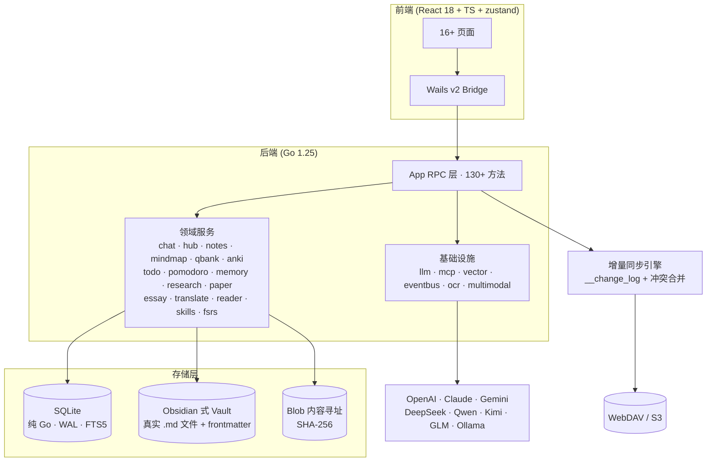

# 🎓 DeepStudent — Go 复刻版

> **`flow/go-replica` 分支**：用 **Go + Wails v2** 全面重建的开源、本地优先 AI 学习工作台。
> 从 Rust (Tauri) 原版 [helixnow/deep-student](https://github.com/helixnow/deep-student) 完全复刻，
> 单一二进制、**25+ 项核心能力**、Obsidian 式知识库、记录级增量同步。

<p align="center">
  
  
  
  
  
</p>

<p align="center">
  <b>本地优先</b> · <b>Obsidian 式知识库</b> · <b>9+ LLM 供应商</b> · <b>端到端加密</b> · <b>多设备增量同步</b>
</p>

---

## ✨ 功能总览

### 🧠 学习能力

| 能力 | 说明 |
|---|---|
| 💬 **Chat v2 智能对话** | 会话持久化 / 工具循环 / 多变体并行 / 回收站 / 标签 / 全文搜索 / 子 Agent |
| 📚 **Hub 学习中心** | 任意资源导入（PDF/DOCX/MD/TXT）、AI 续写笔记、统一 `vfs://` 寻址 |
| 🧭 **Mindmap 思维导图** | LLM 生成 / 大纲↔导图互转 / 节点背书遮罩 |
| 🃏 **Anki 制卡 + FSRS** | 批量制卡、模板管理（CRUD/导入导出）、**FSRS-6 间隔重复**、复习日志 |
| 📝 **Notes 笔记** | CRUD / 回收站 / 文件夹树 / 附件 / 导入导出，**内容落盘 vault 文件** |
| 📖 **Reader 阅读器** | PDF / DOCX / Markdown 分页解析、AI 摘要、引用注入聊天 |
| 📊 **QBank 题库** | LLM 抽题 / 练习会话 / 自动阅卷 / 知识点掌握度 |
| 🍅 **Pomodoro 番茄钟** | 专注计时 / 记录 / 统计图表 / 白噪音入口 |
| ✅ **Todo 待办** | 多列表 / 子任务 / 优先级 / 截止 / 回收站 / **AI 任务拆解** |

### 🤖 AI 与智能

| 能力 | 说明 |
|---|---|
| 🌐 **9+ LLM 供应商** | OpenAI / Claude / Gemini / DeepSeek / Qwen / Kimi / GLM / Ollama / 任意兼容端点，**统一路由与用量统计** |
| 🧠 **Memory 记忆库** | 对话事实抽取、**记忆即文件夹**（可嵌套）、双向关系、审计日志、画像聚合、衰减 |
| 🔍 **Multimodal 多模态** | 资源切块 + 向量嵌入 + 关键词/向量混合检索 |
| 👁️ **OCR 多引擎** | DeepSeek-VL API / 系统 OCR / Paddle 占位，PDF 整卷识别流程 |
| 🔬 **Research 深度调研** | 计划 → 分步执行 → 综合报告，可取消、可断点续跑 |
| 📄 **Paper 论文检索** | arXiv / OpenAlex、PDF 下载、BibTeX/APA/GB7714 引用 |
| 🎙️ **Voice 语音输入** | ASR 转写（SiliconFlow 默认，多 provider 可配） |
| 🧩 **Skill / MCP / 插件** | 内置技能、MCP stdio+SSE、**受管插件生态**（安装/启用/卸载） |
| ⚡ **Quick Assistant** | 轻量快速问答助手 |

### 🔐 数据与工程

| 能力 | 说明 |
|---|---|
| 📁 **Obsidian 式 Vault** | 笔记/导图/题库以**真实 `.md` 文件**落盘（YAML frontmatter + `[[双链]]` + 图谱），可直接用 Obsidian 打开 |
| ☁️ **Cloud Storage** | WebDAV / S3 统一存储 + **加密 ZIP 版本同步**（断点续传、版本管理） |
| 🔄 **记录级增量同步** | `__change_log` 触发器、LWW 冲突合并、tombstone 删除传播、隔离区 |
| 🔒 **AES-256-GCM 加密** | 双槽 A/B 密钥、Argon2id 派生、加密备份/恢复、审计日志 |
| ⚙️ **LLM 用量统计** | 调用日志 + 按日聚合 + 成本估算 |
| 📦 **单一二进制** | 纯 Go SQLite（无 CGo）+ 嵌入式前端，无运行时依赖 |

---

## 🏗️ 架构



---

## 🚀 快速开始

```bash
# 1. 安装 Wails CLI
go install github.com/wailsapp/wails/v2/cmd/wails@v2.12.0

# 2. 准备环境变量（至少一个 LLM 供应商 API Key）
cp .env.example .env

# 3. 开发模式（前端热重载，弹出桌面窗口）
wails dev

# 4. 生产构建
wails build -clean -o build/bin/deepstudent
```

**首次启动**：数据自动写入 vault（默认 `~/Documents/DeepStudent`，可用 `DEEPSTUDENT_VAULT` 覆盖），
存量 blob 数据自动迁移为真实文件。

### 测试

```bash
go test ./... -count=1 -race   # 41 个包全部通过
go run ./scripts/smoke         # 25 组端到端能力冒烟
```

---

## 📁 本分支说明

本分支 `flow/go-replica` 承载 **Go 复刻工程本身**（分支树 = Go 项目，非 Rust 原版）：

- 复刻基准：上游 `main`（v0.9.43 + 2026-08-04 增量）
- 复刻口径：**功能等价**（数据模型对齐 + 命令齐全 + 页面可用 + 测试通过）
- 详细差距分析与路线图：`docs/replica-gap-analysis.md` · `docs/replica-roadmap.md`
- 分支定位：**不合并回上游**，独立演进，每批次完成即推送

| 批次 | 内容 | 状态 |
|---|---|---|
| 批次 1 | Obsidian 式 VFS + Todo / Pomodoro / LLM 用量 | ✅ |
| 批次 2 | Cloud Storage / 增量同步 / 模板管理 / 语音输入 | ✅ |
| 批次 3 | Memory-as-VFS / OCR / Multimodal | ✅ |
| 批次 4 | chat_v2 完整流水线 | ✅ |
| 批次 5 | FSRS / 插件 / 快速助手 / 沙盒 / i18n | ✅ |

---

## 📄 许可

[AGPL-3.0](./LICENSE) — 与上游一致。本分支为个人复刻学习项目。
